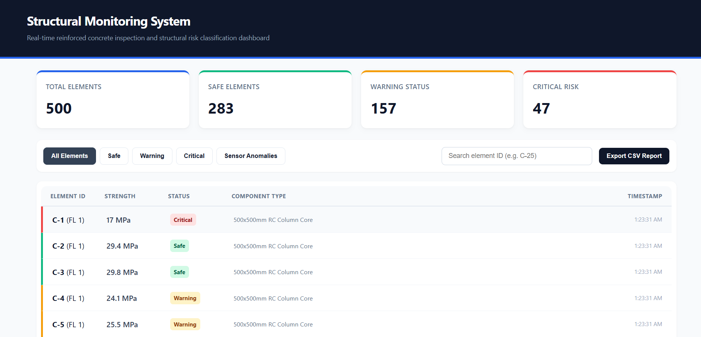

# 🏗️ Structural Health Monitoring Dashboard

## 🔍 At A Glance: Problem vs. Solution

| ❌ The Old Problem |  The New Solution |
| :--- | :--- |
| **Slow Paperwork:** Building inspectors use clipboards and paper sheets to check concrete columns. It takes days to find mistakes, and reports get lost easily. | **Instant Safety Tracking:** This digital dashboard reads 500 columns in seconds, auto-calculates load limits, and highlights critical risks instantly using clear colors. |

### 📱 Live User Interface

---

This is a web dashboard built to check building safety in real time. It helps structural engineers monitor concrete columns easily without slow paperwork.

## 🚀 Key Features
- **Smart Data Simulation:** Tracks 500 concrete columns across 10 floors. Columns on lower floors show a higher risk of stress and warnings, just like a real building.
- **Live Safety Calculations:** Automatically calculates the maximum load capacity ($P_n$) for each column using real engineering formulas.
- **Sensor Error Detection:** Automatically catches hardware mistakes (like negative numbers) and labels them as "Sensor Anomalies" so engineers know when a machine needs fixing.
- **Easy Interface:** Includes a colorful doughnut chart, a fast search bar, a sliding panel for detailed logs, and an Excel/CSV export button for field reports.

## 🛠️ Built With
- **HTML5 & CSS3:** For a clean, responsive layout and colors.
- **JavaScript (ES6):** For sorting, filtering, data calculations, and state management.
- **Chart.js:** For the visual analytics chart.

## 📄 License
This project is licensed under the MIT License - see the [LICENSE](LICENSE) file for details.
